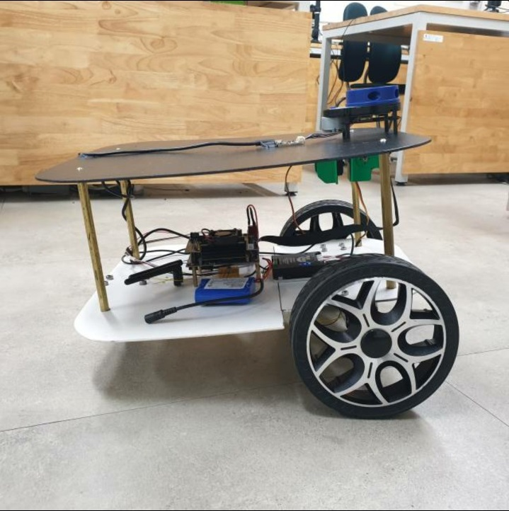
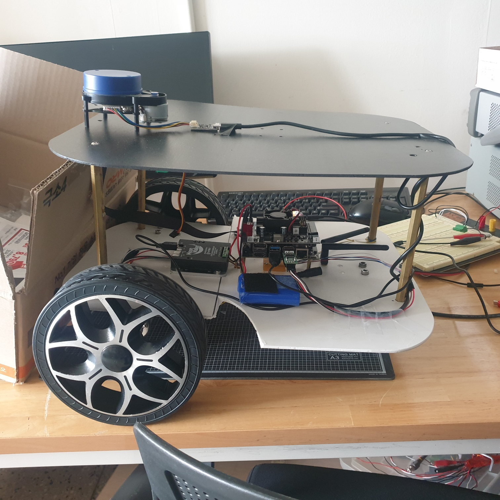

# 실내 SLAM 구축을 위한 자율주행로봇 개발

## 📌 프로젝트 개요

이 프로젝트는 실내 자율주행 알고리즘의 핵심인 SLAM (Simultaneous Localization and Mapping) 기술을 기반으로, 다양한 실내 환경에 적용 가능한 자율주행 로봇 프로토타입을 개발하는 것을 목표로 합니다. 본 로봇은 실시간으로 실내 지도를 작성하고 위치를 추정하며, 무인 서점, 서빙 로봇, 창고 관리 로봇 등 여러 분야에서 응용할 수 있도록 설계되었습니다.

## 👥 팀 정보

**2022 전자공학 Capstone Design 경진대회**  
**엔트로피**  
이재근, 손병하, 남호동, 구희문, 양선미, 정연관  
**발표일자:** 2022년 12월 18일

---

## ⚙️ 시스템 구성 블록도

### 통신 및 전원 구성
- 검은 선: UART/RS232 통신
- 붉은 선: 12V 전원

### 주요 구성 요소
| 부품명          | 역할 |
|----------------|------|
| **Jetson Nano**    | SBC, ROS 통신 및 센서 데이터 수집 |
| **MW-AHRSv1**       | IMU 센서로, 위치 및 속도, Odometry 데이터 반환 |
| **X4 Lidar**        | 거리 감지 센서, SLAM용 거리 측정 |
| **Motor Driver**    | 모터 제어, 엔코더 값을 통해 입력을 제어 |
| **DC Motor + Encoder** | 이동 동작 및 피드백 수집 장치 |
| **Battery 12V**     | 시스템 전원 공급 |

---

## 🛠 개발 내용

- 실내 로봇을 구성하여 전기관 3층을 주행하며 SLAM Map을 생성
- 총 10회 시도 중 Best Case Map을 선택하여 평가
- 초기에는 회전 속도 문제로 지도 연결 오류 발생 → 엔코더 값을 조정하여 개선
- 최종적으로 생성된 SLAM Map과 누적된 데이터를 비교 분석하여 검증

---

## 🧠 적용 기술 및 알고리즘

- **SLAM 알고리즘:** Google의 Cartographer SLAM
- **ROS (Robot Operating System)** 기반 센서 통합 및 통신
- **센서 통합:** IMU, Lidar, Camera 등을 통해 주변 환경 인식 및 위치 추정
- **실시간 지도 작성 및 위치 추정 (Real-time SLAM)**

---

## ✅ 결과 및 기대효과

### 결과
- 실내에서 안정적인 SLAM 지도 생성 성공
- Best Case Map을 통한 고정밀 지도 구성
- 모터 회전 조정 후 SLAM 성능 향상 확인

### 기대효과
- 실내 자율주행 시스템의 **플랫폼 제공**
- 다양한 업종에 적용 가능한 **기본 BASE CASE** 제시
- 향후 무인 서점, 서빙 로봇, 창고 관리 등으로 확장 가능성 확보

---

## 🖼 자율주행 로봇 사진

| 로봇 시제품 (정면) | 로봇 시제품 (측면) |
|------------------|------------------|
|  |  |

---

## 📎 참고

- ROS 설치 및 Cartographer SLAM 튜토리얼: https://google-cartographer.readthedocs.io
- Jetson Nano 개발 문서: https://developer.nvidia.com/embedded/jetson-nano-developer-kit
